# Automatic Brain Tumor Segmentation from MRI Images

<div align="center">

[](https://pytorch.org/)
[](https://www.synapse.org/brats2021)
[]()
[]()
[](https://streamlit.io/)
[](LICENSE)
[](https://YOUR_OVERLEAF_OR_PDF_LINK_HERE)

<br>

**An end-to-end deep learning pipeline for multiclass brain tumor segmentation and grade classification from multi-modal MRI, achieving Mean Dice 0.828 and ET Dice 0.860 — competitive with published 3D architectures.**

<br>

*Rajani Lamichhane — Machine Learning Engineer · Computer Vision · Biomedical AI*

<br>

📄 **[Read the full technical report (PDF)](docs/brain_tumour_seg_documents.pdf)** — architecture details, bug analysis, training curves, and extended results.

</div>

---

## Abstract

Brain tumor segmentation from MRI is a critical yet time-consuming clinical task prone to inter-observer variability. This project presents a fully automated pipeline that performs pixel-level multiclass segmentation of three tumor subregions — Necrotic Core/Non-Enhancing Tumor (NCR/NET), Peritumoral Edema, and Enhancing Tumor (ET) — followed by tumor severity classification and LGG/HGG grade prediction, all from four-modality MRI input.

A 2D Attention U-Net trained on BraTS 2021 achieves **Mean Dice 0.828** and **ET Dice 0.860**, surpassing published 3D architectures at significantly lower computational cost. A critical data pipeline bug discovered during development — where naive alphabetical file slicing caused T1CE to be absent from all training batches — is fully documented. Fixing it improved ET Dice from **0.000 to 0.860** without any architectural changes, demonstrating that correct data assembly can matter more than model sophistication.

---

## Pipeline




## Architecture — Attention U-Net




**Tumor Profile Classifier** — CNN predicting severity (No Tumor / Edema Only / Core Present / Full Tumor) from T1CE slice.

**LGG/HGG Grade Classifier** — ResNet-18 fine-tuned for binary grade prediction; first conv adapted from 3→1 channel for grayscale T1CE input.

---

## Results

### Model Comparison

| Model | Mean Dice | Mean IoU | Accuracy |
|-------|:---------:|:--------:|:--------:|
| U-Net Binary | 0.146 | 0.096 | 0.941 |
| Attention U-Net Binary | 0.141 | 0.092 | 0.944 |
| U-Net Multiclass | **0.828** | **0.763** | 0.993 |
| Attention U-Net Multiclass | **0.828** | **0.763** | **0.993** |

### Comparison with Published Baselines

| Method | NCR/NET | Edema | ET | Mean Dice |
|--------|:-------:|:-----:|:--:|:---------:|
| Standard 2D U-Net (literature) | 0.550 | 0.720 | 0.670 | 0.650 |
| 3D ResU-Net — Myronenko (2018) | 0.810 | 0.840 | 0.800 | 0.820 |
| **This work — 2D U-Net** | **0.827** | 0.798 | **0.860** | **0.828** |
| **This work — Attention U-Net** | 0.820 | **0.803** | 0.859 | **0.828** |

> A correctly assembled 2D model surpasses 3D ResU-Net on ET Dice (0.860 vs 0.800). Attention gates provided no measurable benefit over plain U-Net (Δ Mean Dice = 0.001), suggesting T1CE already provides sufficient spatial discriminative signal for ET localization.

---

## Key Finding — Critical Data Pipeline Bug

> **ET Dice was 0.000 for all training epochs. The entire improvement to 0.860 came from fixing one line of data loading code.**

### Root Cause

The original dataset loader grouped files by naive alphabetical index slicing:

```python
# WRONG — alphabetical sorting orders by modality name, not by slice
groups = all_images[i*4 : i*4+4]
# Result: [flair_000, flair_001, flair_002, flair_003]
# T1CE is never included in any training batch
```

Because alphabetical order places all FLAIR slices before T1 and T1CE slices, every training sample received four consecutive FLAIR slices — never the four required modalities. Since Enhancing Tumor is only detectable on T1CE, the model had no signal to learn ET boundaries.

A secondary bug: `"t1"` is a substring of `"t1ce"`, causing naive string matching to misclassify T1CE files as T1. Fixed by checking `"t1ce"` before `"t1"`.

### Fix — Stem-Based Modality Matching

```python
# For each mask file e.g. "BraTS2021_00000_000.png"
# find the correct modality image for that exact slice:

slice_key = stem.replace(f"_{mod}_", "_")
slice_to_mods[slice_key][mod] = img_file

# Guarantees:
#   BraTS2021_00000_t1_000.png    → Ch0  T1
#   BraTS2021_00000_t1ce_000.png  → Ch1  T1CE  ← ET signal restored
#   BraTS2021_00000_t2_000.png    → Ch2  T2
#   BraTS2021_00000_flair_000.png → Ch3  FLAIR
```

### Impact

| Metric | Before Fix | After Fix | Δ |
|--------|:----------:|:---------:|:-:|
| Enhancing Tumor Dice | 0.000 | **0.860** | +0.860 |
| NCR/NET Dice | 0.170 | **0.827** | +0.657 |
| Edema Dice | 0.004 | **0.798** | +0.794 |
| Mean Dice | 0.174 | **0.828** | +0.654 |

*No architectural changes. No hyperparameter tuning. Pure data pipeline fix.*

---

## Dataset

**BraTS 2021** is used for all three models — segmentation, profile classification, and grade prediction.

| Property | Value |
|----------|-------|
| Modalities | T1, T1CE, T2, FLAIR |
| Format | PNG (converted from NIfTI) |
| Resolution | 240 × 240 |
| Segmentation classes | Background · NCR/NET · Edema · ET |
| Grade split | 43% LGG · 57% HGG — 75,487 slices total |

| Modality | Clinical Role |
|----------|--------------|
| T1 | Anatomical reference |
| **T1CE** | **Enhancing Tumor** — gadolinium contrast enhancement |
| T2 | Edema and fluid content |
| FLAIR | Peritumoral edema, CSF suppressed |

> Raw BraTS label `4` (Enhancing Tumor) is remapped to `3` during preprocessing.

---

## Training Configuration

| Parameter | Segmentation | Classifiers |
|-----------|:------------:|:-----------:|
| Epochs | 75 | 30 |
| Batch size | 16 | 16 |
| Optimizer | Adam | Adam |
| Learning rate | 1×10⁻⁴ | 1×10⁻⁴ |
| LR scheduler | StepLR (step=10, γ=0.5) | StepLR |
| Loss | Dice + Cross-Entropy | Weighted Cross-Entropy |

**Preprocessing:** Z-score normalization per channel over brain-masked pixels (threshold > 0.1 after /255 scaling).

**Augmentation:** Horizontal/vertical flip · Random 90° rotation · Brightness & contrast · Gaussian noise · Affine transforms. All spatial augmentations applied identically across all 4 channels and the mask to preserve alignment.

---

## Web Application

A Streamlit interface provides real-time end-to-end analysis from raw MRI upload to grade prediction.

**Capabilities:** color-coded segmentation overlay · region pixel statistics · tumor severity profile · LGG/HGG grade prediction with clinical reasoning · attention heatmap visualization.

```bash
streamlit run app.py
```

Upload files following the BraTS naming convention — `BraTS2021_XXXXX_t1_YYY.png`, `_t1ce_`, `_t2_`, `_flair_`. Middle slices (035–065) show the most complete tumor core.

---

## Project Structure

```
├── assets/                  # Diagram images for README
│   ├── pipeline.png
│   └── unet_architecture.png
├── configs/
│   └── config.py
├── data/
│   ├── train/
│   ├── val/
│   └── test/
├── docs/
│   └── report.pdf           # Full technical report
├── src/
│   ├── datasets/            # Stem-based modality matching loader
│   ├── models/              # U-Net, Attention U-Net, ResNet-18
│   ├── training/
│   ├── evaluation/
│   ├── inference/
│   └── visualization/
├── notebook/
│   └── data_processing.ipynb
├── app.py                   # Streamlit clinical interface
├── main.py
└── requirements.txt
```

---

## Getting Started

```bash
git clone https://github.com/rajanilamichhane/Automatic-Brain-Tumor-Segmentation-from-MRI-Images-using-U-Net.git
cd Automatic-Brain-Tumor-Segmentation-from-MRI-Images-using-U-Net
pip install -r requirements.txt
```

```bash
# Train segmentation model
python main.py --mode train --model attn_unet_multiclass

# Evaluate
python main.py --mode eval --model attn_unet_multiclass --checkpoint path/to/checkpoint.pth

# Launch web app
streamlit run app.py
```

---

## Limitations

- **2D processing** — slice-level inference loses volumetric context across adjacent slices
- **Overfitting** — training and validation Dice diverge in later epochs; additional regularization warranted
- **Distribution shift** — PNG-converted slices may differ from native NIfTI used in clinical scanners

## Future Work

- 3D volumetric segmentation on full NIfTI volumes
- Transformer-based architectures — TransUNet, Swin-UNet
- GradCAM / SHAP explainability per modality
- Multi-scanner domain adaptation
- Docker containerization for portable clinical deployment

---

## Technical Report

The full project report is written in LaTeX and covers extended methodology, training curves, ablation studies, and the complete bug analysis.

📄 **[Open report (PDF)](https://www.overleaf.com/read/xcwqggrmftng#c98b9d)** — opens in a new browser tab.


>
> **To link a PDF in the repo:** Commit `docs/report.pdf` to your repository, then replace the link with:
> `https://github.com/rajanilamichhane/Automatic-Brain-Tumor-Segmentation-from-MRI-Images-using-U-Net/docs/report.pdf`

---

## References

1. Ronneberger, O., Fischer, P., & Brox, T. (2015). *U-Net: Convolutional Networks for Biomedical Image Segmentation.* MICCAI.
2. Oktay, O., et al. (2018). *Attention U-Net: Learning Where to Look for the Pancreas.* MIDL.
3. He, K., et al. (2016). *Deep Residual Learning for Image Recognition.* CVPR.
4. Myronenko, A. (2018). *3D MRI Brain Tumor Segmentation Using Autoencoder Regularization.* BraTS @ MICCAI.
5. Baid, U., et al. (2021). *The RSNA-ASNR-MICCAI BraTS 2021 Benchmark.* arXiv:2107.02314.
6. Menze, B. H., et al. (2015). *The Multimodal Brain Tumor Image Segmentation Benchmark.* IEEE TMI, 34(10).

---

## Author

**Rajani Lamichhane**  
Machine Learning Engineer · Computer Vision · Biomedical AI

---

<div align="center">
<sub>If this work helped your research, please consider giving it a ⭐</sub>
</div>