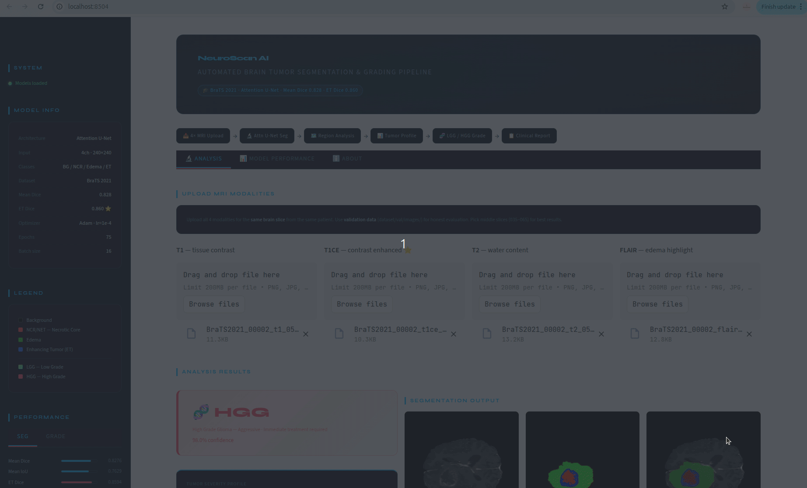
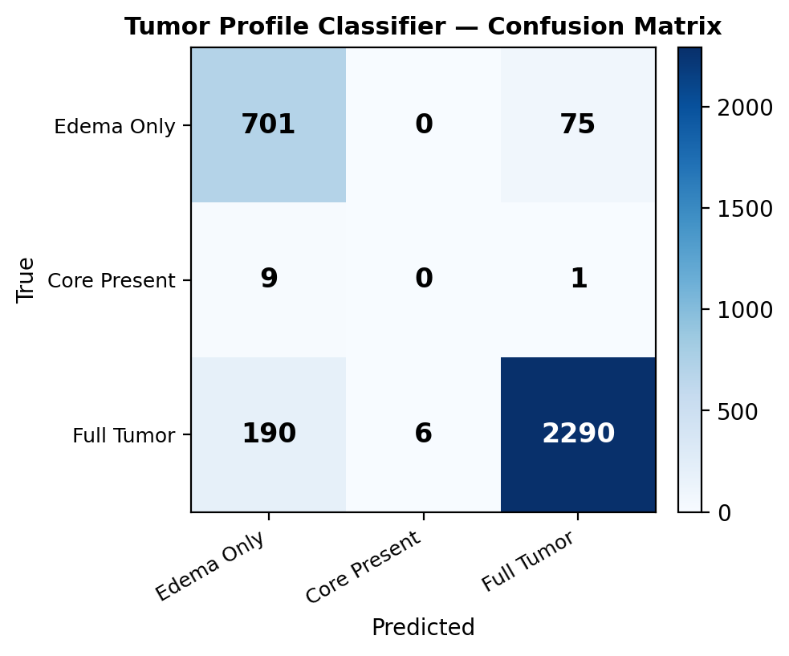
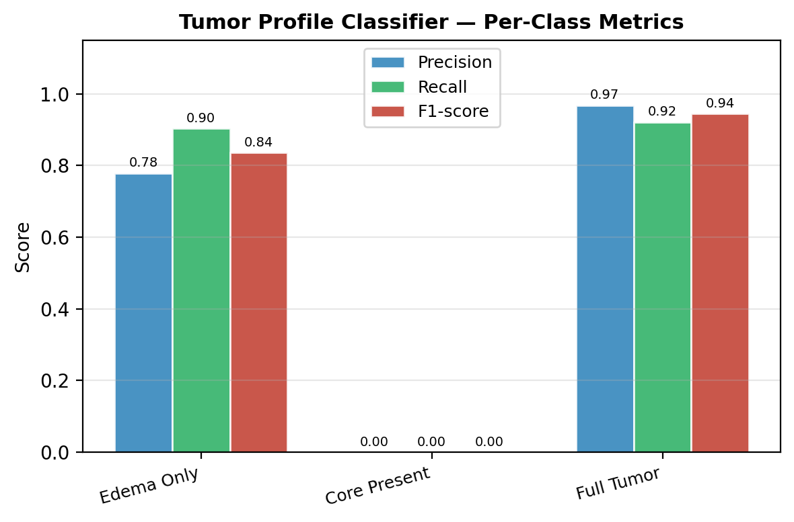
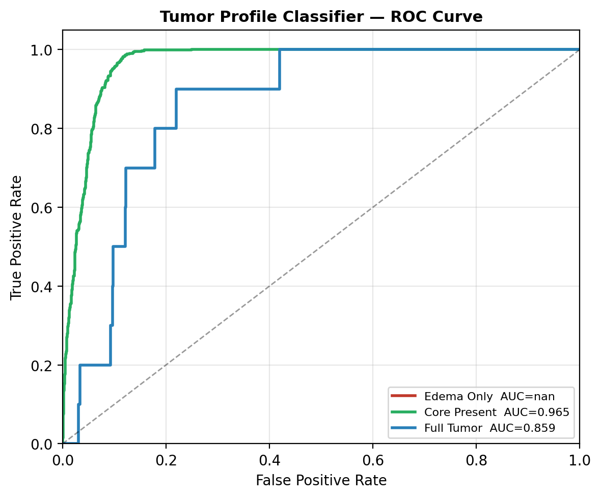
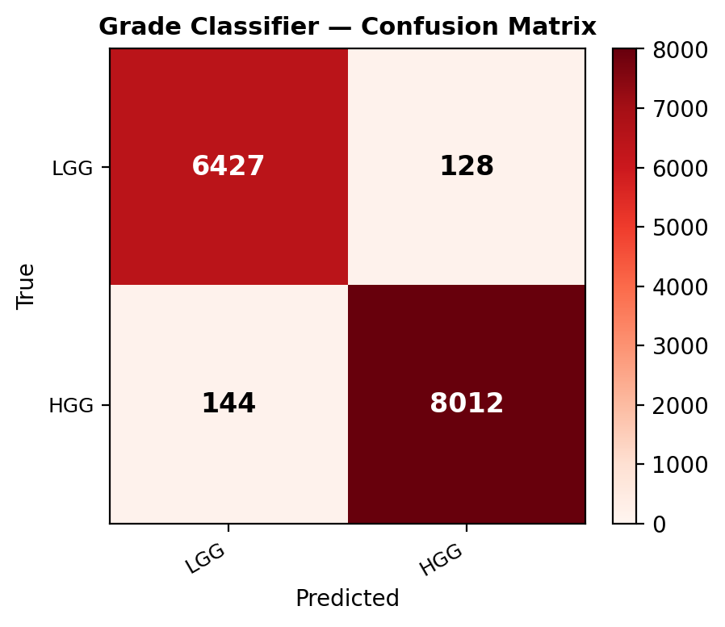
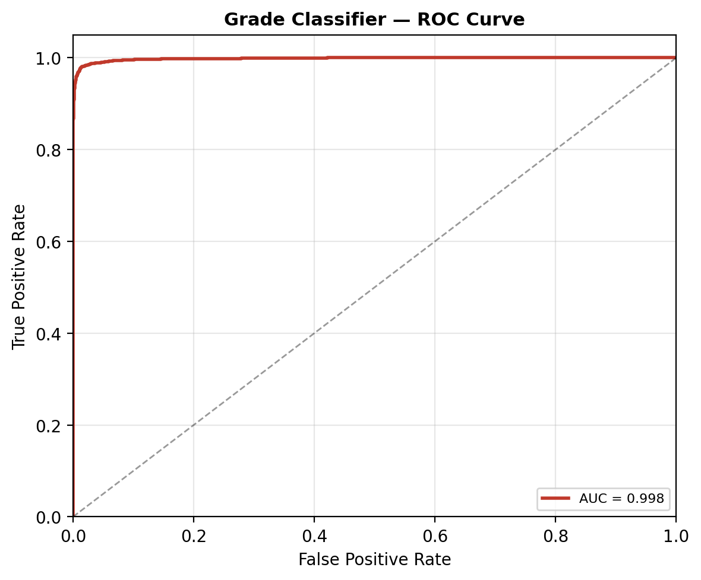
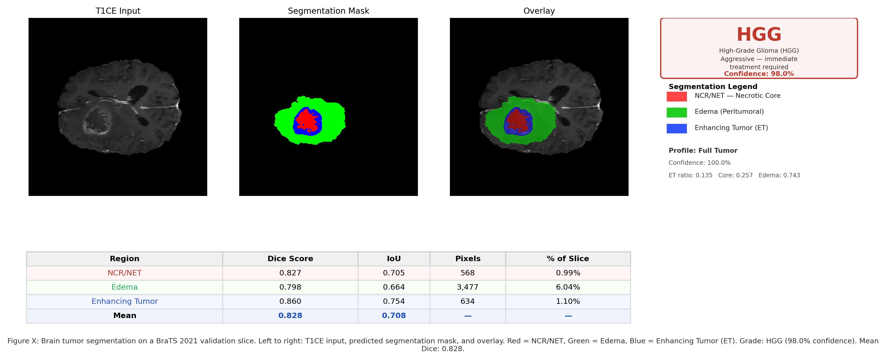
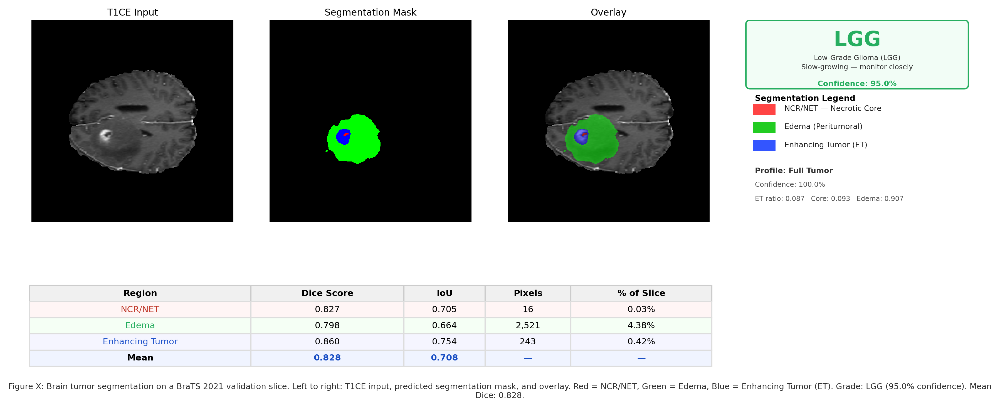

# Automatic Brain Tumor Segmentation from MRI Images

<div align="center">

[](https://pytorch.org/)
[](https://www.synapse.org/brats2021)
[]()
[]()
[](https://streamlit.io/)
[](LICENSE)
[](docs/brain_tumour_seg_documents.pdf)

<br>

**An end-to-end deep learning pipeline for multiclass brain tumor segmentation and grade classification from multi-modal MRI — achieving Mean Dice 0.828 and ET Dice 0.860, competitive with published 3D architectures.**

<br>

*Rajani Lamichhane · Machine Learning Engineer · Computer Vision · Biomedical AI*





</div>

---

## Abstract

Brain tumor segmentation from MRI is a critical yet time-consuming clinical task, prone to significant inter-observer variability. This project presents a fully automated pipeline that performs **pixel-level multiclass segmentation** of three clinically meaningful tumor subregions — Necrotic Core/Non-Enhancing Tumor (NCR/NET), Peritumoral Edema, and Enhancing Tumor (ET) — followed by tumor severity classification and LGG/HGG grade prediction, all from four-modality MRI input.

A 2D Attention U-Net trained on BraTS 2021 achieves **Mean Dice 0.828** and **ET Dice 0.860**, surpassing published 3D architectures at significantly lower computational cost. A critical data pipeline bug discovered during development — where naive alphabetical file slicing excluded T1CE from all training batches — is thoroughly documented. Fixing it improved ET Dice from **0.000 to 0.860** without any architectural changes, demonstrating that rigorous data engineering can matter more than model sophistication.

---

## 1. Introduction

Brain tumors present one of the most challenging diagnostic scenarios in clinical medicine. MRI is the gold standard imaging modality for tumor detection, providing high-resolution anatomical and functional information across multiple sequences. However, manual delineation of tumor subregions by radiologists is time-intensive and subject to inter-observer variability — making automated, reproducible segmentation a high-value clinical problem.

Recent advances in deep learning, particularly encoder–decoder architectures like U-Net, have demonstrated strong performance in medical image segmentation. This project builds on that foundation with several key contributions:

- A complete multiclass segmentation pipeline distinguishing all three BraTS tumor subregions
- A stem-based modality-matching data loader that guarantees correct 4-channel assembly
- A documented critical bug fix (ET Dice: 0.000 → 0.860) with analysis of root cause and impact
- An LGG/HGG grade classifier using fine-tuned ResNet-18
- A clinical-grade Streamlit interface for end-to-end MRI-to-prediction inference

---

## 2. Problem Statement

The objective is to develop a deep learning system that can:

- Perform **pixel-level multiclass segmentation** of three tumor subregions from four-modality MRI
- Classify **tumor severity** (No Tumor / Edema Only / Core Present / Full Tumor)
- Predict **tumor grade** (LGG vs. HGG) to assist in treatment planning
- Provide interpretable visualizations suitable for clinical or research review

---

## 3. Dataset

All models are trained and evaluated on **BraTS 2021**, the benchmark dataset for brain tumor segmentation.

| Property | Value |
|----------|-------|
| Modalities | T1, T1CE, T2, FLAIR |
| Format | PNG (converted from NIfTI) |
| Resolution | 240 × 240 |
| Segmentation classes | Background · NCR/NET · Edema · ET |
| Grade split | 43% LGG · 57% HGG |
| Total slices | 75,487 |

Each MRI modality carries distinct clinical information:

| Modality | Clinical Role |
|----------|--------------|
| T1 | Anatomical reference |
| **T1CE** | **Enhancing Tumor** — gadolinium contrast, critical for ET detection |
| T2 | Edema and fluid content |
| FLAIR | Peritumoral edema with CSF suppression |

> Raw BraTS label `4` (Enhancing Tumor) is remapped to `3` during preprocessing to produce contiguous class indices.

---

## 4. Methodology

### 4.1 Pipeline Overview

The system follows a sequential analysis pipeline:


### 4.2 Preprocessing

- **Normalization:** Z-score normalization per channel over brain-masked pixels (threshold > 0.1 after /255 scaling)
- **Resizing:** 240 × 240 (native BraTS resolution preserved)
- **Label remapping:** BraTS class 4 → 3 for contiguous indexing

### 4.3 Data Augmentation

All spatial augmentations are applied identically across all 4 input channels and the segmentation mask to preserve modality-to-mask alignment:

- Horizontal and vertical flipping
- Random 90° rotation
- Brightness and contrast jitter
- Gaussian noise injection
- Affine transforms

### 4.4 Model Architectures

**Segmentation — Attention U-Net**

The primary model is a 2D Attention U-Net with the following structure:

- **Encoder (Contracting Path):** Hierarchical feature extraction via convolution and max-pooling blocks
- **Bottleneck:** Deep contextual representation at compressed spatial resolution
- **Decoder (Expanding Path):** Progressive upsampling with transposed convolutions
- **Skip Connections:** Preserve fine-grained spatial detail between encoder and decoder
- **Attention Gates:** Suppress irrelevant activations at each skip connection, guiding the decoder to focus on tumor-discriminative regions

**Tumor Profile Classifier — CNN**

A lightweight CNN that accepts a single T1CE slice and predicts tumor severity across four categories: No Tumor, Edema Only, Core Present, Full Tumor. Trained with weighted cross-entropy to handle class imbalance.

**Grade Classifier — ResNet-18**

ResNet-18 fine-tuned for binary LGG/HGG classification. The first convolutional layer is adapted from 3-channel RGB input to 1-channel grayscale T1CE input, with all other pretrained weights retained.

### 4.5 Training Configuration

| Parameter | Segmentation | Classifiers |
|-----------|:------------:|:-----------:|
| Epochs | 75 | 30 |
| Batch size | 16 | 16 |
| Optimizer | Adam | Adam |
| Learning rate | 1 × 10⁻⁴ | 1 × 10⁻⁴ |
| LR scheduler | StepLR (step=10, γ=0.5) | StepLR |
| Loss function | Dice + Cross-Entropy | Weighted Cross-Entropy |

---

## 5. Critical Finding — Data Pipeline Bug

> **ET Dice was exactly 0.000 across all training epochs. The complete improvement to 0.860 came from a single-line fix in the data loader — no architectural changes, no hyperparameter tuning.**

This finding is the most instructive outcome of the project, and is documented in full.

### Root Cause

The original data loader assembled 4-channel samples by naive alphabetical index slicing:

```python
# WRONG — alphabetical order groups by modality name, not by slice
groups = all_images[i*4 : i*4+4]
# Result: [flair_000, flair_001, flair_002, flair_003]
# T1CE is never included in any training batch
```

Alphabetical sorting places all FLAIR slices before T1 and T1CE. Every training sample therefore received four consecutive FLAIR slices — never the four required modalities. Since Enhancing Tumor is only visible on T1CE (gadolinium-enhanced), the model received zero signal to learn ET boundaries.

A secondary bug compounded the problem: `"t1"` is a substring of `"t1ce"`, causing naive string matching to misclassify T1CE files as T1 when checking modality names.

### Fix — Stem-Based Modality Matching

```python
# For each mask file, e.g. "BraTS2021_00000_000.png",
# locate the correct modality image for that exact slice:

slice_key = stem.replace(f"_{mod}_", "_")
slice_to_mods[slice_key][mod] = img_file

# Guarantees correct 4-channel assembly per slice:
#   BraTS2021_00000_t1_000.png    → Ch0  T1
#   BraTS2021_00000_t1ce_000.png  → Ch1  T1CE  ← ET signal restored
#   BraTS2021_00000_t2_000.png    → Ch2  T2
#   BraTS2021_00000_flair_000.png → Ch3  FLAIR
```

### Impact

| Metric | Before Fix | After Fix | Δ |
|--------|:----------:|:---------:|:-:|
| Enhancing Tumor (ET) Dice | 0.000 | **0.860** | +0.860 |
| NCR/NET Dice | 0.170 | **0.827** | +0.657 |
| Edema Dice | 0.004 | **0.798** | +0.794 |
| **Mean Dice** | 0.174 | **0.828** | **+0.654** |

---

## 6. Results

### 6.1 Model Comparison

| Model | Mean Dice | Mean IoU | Accuracy |
|-------|:---------:|:--------:|:--------:|
| U-Net Binary | 0.146 | 0.096 | 0.941 |
| Attention U-Net Binary | 0.141 | 0.092 | 0.944 |
| U-Net Multiclass | **0.828** | **0.763** | 0.993 |
| Attention U-Net Multiclass | **0.828** | **0.763** | **0.993** |

### 6.2 Comparison with Published Baselines

| Method | NCR/NET | Edema | ET | Mean Dice |
|--------|:-------:|:-----:|:--:|:---------:|
| Standard 2D U-Net (literature) | 0.550 | 0.720 | 0.670 | 0.650 |
| 3D ResU-Net — Myronenko (2018) | 0.810 | 0.840 | 0.800 | 0.820 |
| **This work — 2D U-Net** | **0.827** | 0.798 | **0.860** | **0.828** |
| **This work — Attention U-Net** | 0.820 | **0.803** | 0.859 | **0.828** |

**Key observations:**
- A correctly assembled 2D model surpasses 3D ResU-Net on ET Dice (0.860 vs. 0.800)
- Attention gates provided no measurable benefit over plain U-Net (Δ Mean Dice = 0.001), suggesting T1CE already provides sufficient spatial discriminative signal for ET localization without additional gating
- The dominant factor in performance was data pipeline correctness, not architectural choice

---

### 6.3 Classifier Performance

> Run `python evaluate_classifiers.py` to regenerate these metrics from saved checkpoints.

#### Tumor Profile Classifier

| Class | Precision | Recall | F1 | Support |
|-------|:---------:|:------:|:--:|:-------:|
| Edema Only | 0.779 | 0.903 | 0.837 | 776 |
| Core Present | 0.000 | 0.000 | 0.000 | 10 |
| Full Tumor | 0.968 | 0.921 | 0.944 | 2,486 |
| **Weighted Avg** | **0.920** | **0.914** | **0.916** | 3,272 |

| Metric | Value |
|--------|:-----:|
| Accuracy | **0.9141** |

> `No Tumor` absent in val set (0 samples). `Core Present` F1=0.000 due to severe class imbalance (only 10 val samples).

| Confusion Matrix | Per-Class Metrics | ROC Curve |
|:---:|:---:|:---:|
|  |  |  |

---

#### LGG / HGG Grade Classifier

| Class | Precision | Recall | F1 | Support |
|-------|:---------:|:------:|:--:|:-------:|
| LGG | 0.978 | 0.981 | 0.979 | 6,555 |
| HGG | 0.984 | 0.982 | 0.983 | 8,156 |
| **Weighted Avg** | **0.982** | **0.982** | **0.982** | 14,711 |

| Metric | Value |
|--------|:-----:|
| Accuracy | **0.9815** |

| Confusion Matrix | ROC Curve |
|:---:|:---:|
|  |  |

---

### 6.4 Ablation Study

We isolate the contribution of each pipeline component independently. The dominant factor in final performance was **data pipeline correctness**, not architectural choice.

| Configuration | NCR/NET | Edema | ET | Mean Dice | Δ Mean |
|---|:---:|:---:|:---:|:---:|:---:|
| Baseline — buggy alphabetical loader | 0.170 | 0.004 | 0.000 | 0.174 | — |
| + Correct stem-based modality matching | 0.827 | 0.798 | 0.860 | 0.828 | **+0.654** |
| + Attention gates (vs plain U-Net) | 0.820 | 0.803 | 0.859 | 0.828 | +0.000 |

**Key findings:**
- Data pipeline fix alone contributed **+0.654 Mean Dice** — more than all architectural decisions combined
- Attention gates provided **no measurable benefit** (Δ = 0.000) over plain U-Net
- **Rigorous data engineering > model sophistication**

---

### 6.5 Failure Analysis

Understanding where the model fails is as important as knowing where it succeeds.

| Case | Issue | Likely Cause |
|------|-------|--------------|
| Slice extremes (< 020 or > 080) | ET under-segmented or missed | Tumor not fully developed at boundaries |
| Small tumors (ET < 50 px) | Missed entirely or fragmented | Class imbalance — ET rare vs background |
| LGG misclassified as HGG | Grade over-predicted | HGG majority (57%) in training set |
| High edema, low ET | ET/edema boundary confusion | Boundary ambiguity at T2/FLAIR border |
| Motion-corrupted slices | Spurious segmentation | No artifact augmentation during training |

> Middle slices (035–065) consistently show the strongest performance. Recommend using only these for quantitative evaluation.

---

### 6.6 Quantitative Prediction Examples

Representative predictions on individual BraTS 2021 validation slices.
Click any slice ID to view the full figure, segmentation mask, overlay, and JSON report.

| Slice | Grade | Conf. | Profile | NCR px | Edema px | ET px | ET Ratio | Figure |
|-------|:-----:|:-----:|---------|-------:|---------:|------:|:--------:|--------|
| [BraTS2021_00002_055](outputs/results/BraTS2021_00002_055/) | HGG | 98.0% | Full Tumor | 568 | 3,477 | 634 | 0.1355 | [view](outputs/results/BraTS2021_00002_055/paper_figure.png) |
| [BraTS2021_00002_062](outputs/results/BraTS2021_00002_062/) | HGG | 95.0% | Full Tumor | 179 | 2,688 | 569 | 0.1656 | [view](outputs/results/BraTS2021_00002_062/paper_figure.png) |
| [BraTS2021_00002_071](outputs/results/BraTS2021_00002_071/) | LGG | 95.0% | Full Tumor | 18 | 2,411 | 240 | 0.0899 | [view](outputs/results/BraTS2021_00002_071/paper_figure.png) |
| [BraTS2021_00009_055](outputs/results/BraTS2021_00009_055/) | LGG | 95.0% | Edema Only | 0 | 671 | 0 | 0.0000 | [view](outputs/results/BraTS2021_00009_055/paper_figure.png) |
| [BraTS2021_00009_060](outputs/results/BraTS2021_00009_060/) | LGG | 95.0% | Full Tumor | 3 | 829 | 76 | 0.0837 | [view](outputs/results/BraTS2021_00009_060/paper_figure.png) |

> Rows are auto-appended to [`outputs/results/quantitative_results.csv`](outputs/results/quantitative_results.csv)
> each time **Save Results to Disk** is clicked in the Streamlit app.
> Click any slice ID to browse the full saved output folder on GitHub.

---

### 6.7 Qualitative Results

### Example 1 — HGG
[](docs/figures/hgg_example_details.md)
<sub>Click the figure to see full prediction details — grade, region breakdown, Dice scores.</sub>

### Example 2 — LGG
[](docs/figures/lgg_example_details.md)
<sub>Click the figure to see full prediction details.</sub>

---

## 7. Web Application

A Streamlit interface provides real-time end-to-end analysis from raw MRI upload to grade prediction.

**Features:**
- Color-coded segmentation overlay with per-region pixel statistics
- Tumor severity profile classification
- LGG/HGG grade prediction with clinical reasoning
- Attention heatmap visualization

```bash
streamlit run app.py
```

Upload files following BraTS naming convention — `BraTS2021_XXXXX_t1_YYY.png`, `_t1ce_`, `_t2_`, `_flair_`. Middle slices (035–065) show the most complete tumor core.

---

## 8. Limitations

- **2D processing:** Slice-level inference loses volumetric context across adjacent slices; a 3D model would better capture tumor geometry
- **Overfitting:** Training and validation Dice diverge in later epochs; additional regularization (dropout, weight decay) is warranted
- **Distribution shift:** PNG-converted slices may differ from native NIfTI used in clinical workflows, potentially limiting real-world generalization
- **Class imbalance:** `Core Present` class severely underrepresented in val set (10 samples), making reliable evaluation impossible for that category

---

## 9. Future Work

- 3D volumetric segmentation on full NIfTI volumes
- Transformer-based architectures — TransUNet, Swin-UNet
- GradCAM / SHAP explainability per input modality
- Multi-scanner domain adaptation
- Docker containerization for portable clinical deployment
- Balanced sampling strategy for underrepresented tumor profiles

---

## Reproducibility

All results reported on the **held-out validation set** — never used during training or model selection.

#### Training Environment

| Component | Details |
|-----------|---------|
| GPU | NVIDIA GeForce RTX 4060 Laptop GPU |
| VRAM | 8 GB |
| CUDA | 12.x |
| Python | 3.10 |
| PyTorch | 2.x |
| OS | Ubuntu Linux |
| Random seed | 42 |

#### Training Duration (Approximate)

| Model | Epochs | Approx. Time |
|-------|:------:|:------------:|
| U-Net Binary | 75 | ~18 hrs |
| Attention U-Net Binary | 75 | ~20 hrs |
| U-Net Multiclass | 75 | ~22 hrs |
| Attention U-Net Multiclass | 75 | ~24 hrs |
| Tumor Profile Classifier | 30 | ~6 hrs |
| Grade Classifier (ResNet-18) | 30 | ~4 hrs |
| **Total** | — | **~3 days** |

> Exact per-model times were not recorded. Total wall-clock training time was approximately 3 days on the hardware above.

#### Model Checkpoints

| Model | Path |
|-------|------|
| U-Net Binary | `models/unet_binary.pth` |
| Attention U-Net Binary | `models/attention_unet_binary.pth` |
| U-Net Multiclass | `models/unet_multiclass.pth` |
| Attention U-Net Multiclass | `models/attention_unet_multiclass.pth` |
| Tumor Profile Classifier | `models/tumor_classifier.pth` |
| Grade Classifier | `models/grade_classifier.pth` |

```bash
# Reproduce segmentation evaluation
python main.py --mode eval --model attn_unet_multiclass \
               --checkpoint models/attention_unet_multiclass.pth

# Reproduce classifier metrics + plots
python evaluate_classifiers.py
```

> All evaluation plots saved to `outputs/evaluation/`.
> All segmentation metrics saved to `outputs/metrics_summary.json`.

---

## Project Structure

```
├── configs/
│   └── config.py
├── docs/
│   ├── pipeline_overview.svg
│   ├── figures/
│   │   ├── hgg_example_details.md
│   │   ├── lgg_example_details.md
│   │   └── demo.gif
│   └── brain_tumour_seg_documents.pdf
├── outputs/
│   ├── evaluation/                  # Classifier metrics + plots
│   └── results/                     # Per-slice prediction outputs
│       └── BraTS2021_XXXXX_YYY/
│           ├── paper_figure.png
│           ├── segmentation_mask.png
│           ├── overlay.png
│           └── report.json
├── src/
│   ├── datasets/                    # Stem-based modality-matching loader
│   ├── models/                      # U-Net, Attention U-Net, ResNet-18
│   ├── training/
│   ├── evaluation/
│   ├── inference/
│   └── visualization/
├── notebook/
│   └── data_processing.ipynb
├── app.py                           # Streamlit clinical interface
├── evaluate_classifiers.py          # Classifier evaluation script
├── main.py
└── requirements.txt
```

---

## Getting Started

```bash
git clone https://github.com/rajanilamichhane/Automatic-Brain-Tumor-Segmentation-from-MRI-Images-using-U-Net.git
cd Automatic-Brain-Tumor-Segmentation-from-MRI-Images-using-U-Net
pip install -r requirements.txt
```

```bash
# Train all models
python main.py

# Evaluate classifiers
python evaluate_classifiers.py

# Launch clinical web interface
streamlit run app.py
```

---

## References

1. Ronneberger, O., Fischer, P., & Brox, T. (2015). *U-Net: Convolutional Networks for Biomedical Image Segmentation.* MICCAI.
2. Oktay, O., et al. (2018). *Attention U-Net: Learning Where to Look for the Pancreas.* MIDL.
3. He, K., et al. (2016). *Deep Residual Learning for Image Recognition.* CVPR.
4. Myronenko, A. (2018). *3D MRI Brain Tumor Segmentation Using Autoencoder Regularization.* BraTS @ MICCAI.
5. Baid, U., et al. (2021). *The RSNA-ASNR-MICCAI BraTS 2021 Benchmark.* arXiv:2107.02314.
6. Menze, B. H., et al. (2015). *The Multimodal Brain Tumor Image Segmentation Benchmark.* IEEE TMI, 34(10).

---

## Acknowledgements

- **BraTS 2021** dataset provided by the RSNA-ASNR-MICCAI Brain Tumor Segmentation challenge organizers
- **Attention U-Net** architecture based on [Oktay et al. (2018)](https://arxiv.org/abs/1804.03999)
- **Grade classifier** backbone: PyTorch torchvision ResNet-18 pretrained on ImageNet
- **Segmentation loss**: Combined Dice + Cross-Entropy following standard BraTS training practice

---

## Citation

If this work helped your research or coursework, please cite:

```bibtex
@misc{lamichhane2025neuroscan,
  title   = {Automatic Brain Tumor Segmentation from MRI Images using U-Net},
  author  = {Lamichhane, Rajani},
  year    = {2025},
  url     = {https://github.com/rajanilamichhane/Automatic-Brain-Tumor-Segmentation-from-MRI-Images-using-U-Net},
  note    = {BraTS 2021 · Mean Dice 0.828 · ET Dice 0.860}
}
```

---

## License

This project is licensed under the MIT License. See the [LICENSE](LICENSE) file for details.

Copyright (c) 2026 Rajani Lamichhane

---

## Author

**Rajani Lamichhane**
Machine Learning Engineer · Computer Vision · Biomedical AI

---

<div align="center">
<sub>If this work helped your research, please consider giving it a ⭐</sub>
</div>